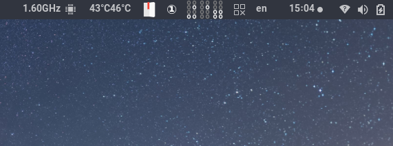

# Rubicl
## Binary clock for argos

Shows a simple binary clock in the Gnome panel. Uses the wonderful [Argos](https://github.com/p-e-w/argos/) extension for Gnome.



## Installation
Copy ```rubicl.1s.argos``` to ```~/.config/argos```.
